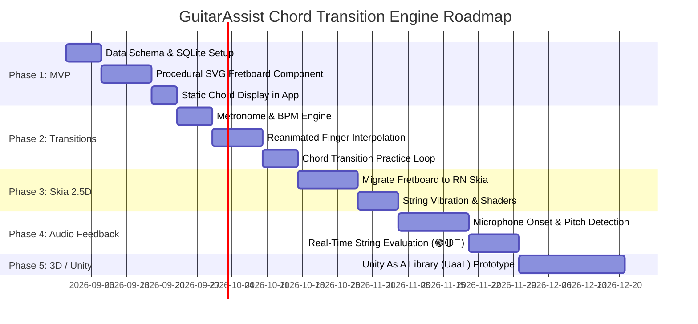

# Chord Transition & Procedural Fretboard System

## 1. Executive Summary & Core Philosophy

The primary objective of the **GuitarAssist** practice engine is to provide an intuitive, pedagogically clear, and dynamic visualization for guitar learning—specifically mastering chord transitions.

### Core Principle
> **"Not 'make a realistic guitar', but 'make the guitar's state visually understandable.'"**

Rather than relying on static chord diagrams (PNGs/SVGs) or attempting heavy 3D CAD modeling (Fusion 360) inside the mobile application, the system strictly separates:
1. **Underlying Data Model** (Geometry, tuning, chord definitions, fingerings).
2. **Visual Renderer** (Procedural Fretboard in SVG $\rightarrow$ Skia $\rightarrow$ 3D).
3. **Practice & Transition Engine** (Timing, metronome, finger animation paths).
4. **Evaluation & Audio Engine** (Expected vs. observed state, real-time string feedback).

---

## 2. Architectural Blueprint

```
                      ┌──────────────────────────────────────┐
                      │             DATA LAYER               │
                      │  SQLite / TypeScript Schema          │
                      │  (ChordShape, Fingering, Tunings)    │
                      └──────────────────┬───────────────────┘
                                         │
                                         ▼
                      ┌──────────────────────────────────────┐
                      │       PRACTICE & STATE ENGINE        │
                      │  BPM, Transition Timing, Paths,      │
                      │  Evaluation (Expected vs. Observed)  │
                      └──────────────────┬───────────────────┘
                                         │
                                         ▼
                 ┌─────────────────────────────────────────────────┐
                 │          PROCEDURAL RENDERER INTERFACE          │
                 │          (Decoupled Fretboard View)             │
                 └───────┬─────────────────┬─────────────────┬─────┘
                         │                 │                 │
                         ▼                 ▼                 ▼
                  [ Phase 1: SVG ]  [ Phase 2: Skia ] [ Phase 3: 3D/Unity ]
                  - React Native SVG - RN Skia Canvas  - Unity As A Library
                  - Declarative JSX  - 60/120fps GPU   - Full 3D Hand Model
                  - Fast MVP Dev     - Shaders & Glow  - Advanced Gamification
```

---

## 3. Decoupled Data Model

The data layer knows nothing about pixels, canvas coordinates, or audio streams.

### A. Chord Geometry Model
```typescript
export interface FingerPosition {
  string: 1 | 2 | 3 | 4 | 5 | 6; // 1 = High E, 6 = Low E
  fret: number;                  // 0 = open, -1 = muted, >0 = fretted
  finger?: 1 | 2 | 3 | 4 | 'T';  // 1: Index, 2: Middle, 3: Ring, 4: Pinky, T: Thumb
  barre?: {
    fromFret: number;
    toString: number;
  };
}

export interface ChordShape {
  id: string;
  name: string;             // e.g. "C Major", "G7"
  familyId: string;         // e.g. "c-major-family"
  baseFret: number;         // 1 for open chords, >1 for barre/higher frets
  positions: FingerPosition[];
  rootString: 1 | 2 | 3 | 4 | 5 | 6;
}
```

### B. Decoupled Evaluation & Feedback Model
```typescript
export interface StringEvaluation {
  stringNumber: 1 | 2 | 3 | 4 | 5 | 6;
  expected: {
    fret: number;
    status: 'fretted' | 'open' | 'muted';
  };
  detected?: {
    played: boolean;
    frequencyHz?: number;
    confidence?: number;
  };
  result: 'correct' | 'incorrect' | 'missing' | 'idle';
}
```

#### Feedback Semantics (Pedagogical Clarity):
* 🟢 **Correct (`correct`)**: Expected fretted/open note was played accurately in pitch and timing.
* 🟡 **Missing (`missing`)**: An expected open or fretted string was not played/detected.
* 🔴 **Wrong (`incorrect`)**: A string was played with the wrong pitch, or an expected **muted** string was accidentally rung out.
* ⚪ **Neutral / Idle (`idle`)**: Awaiting strum or in countdown state.

---

## 4. Renderer Strategy & Technology Evaluation

### Stage 1: React Native SVG (`react-native-svg`) — *Recommended for MVP*
* **Why start here:**
  * Zero additional C++ native compilation hurdles; already included in Expo projects.
  * Fast declarative development: draw frets as `<Line />`, strings as `<Line strokeWidth={...} />`, and fingers as `<Circle />`.
  * Fully scriptable with `react-native-reanimated` for smooth finger coordinate translations.
* **Limitations:** CPU-bound when dealing with hundreds of particle effects, dynamic string vibration waves, or complex lighting shaders.

### Stage 2: React Native Skia (`@shopify/react-native-skia`) — *Enhanced 2.5D*
* **Why upgrade to Skia:**
  * Direct GPU hardware acceleration via Google's Skia engine.
  * Real-time canvas drawing: dynamic string vibrations, neon/glow shaders for active strings, strum line trails, and fluid finger morphing at 120 FPS.
  * Retains 100% of the React Native component lifecycle without needing a separate engine runtime.

### Stage 3: Unity / 3D Engine — *Future Exploration*
* **When Unity makes sense:**
  * Interactive 3D hand/skeleton models showing exact wrist angle, thumb placement behind the neck, and 360-degree camera rotation.
  * Deep gamification (e.g. *Rocksmith* / *Guitar Hero* 3D highway perspective).
* **Architectural Integration:**
  * Use **Unity as a Library (UaaL)** embedded inside the React Native shell (`react-native-unity-view`).
  * React Native continues to handle authentication, SQLite chord database, routing, and practice playlists, while sending structured `ChordShape` JSON packets over the bridge to the Unity canvas.

---

## 5. Phased Implementation Roadmap



### Phase 1: Data Model & Procedural SVG Fretboard (MVP)
1. **Database & Types:**
   * Create standard guitar chord definitions in SQLite with finger numbers (1–4, T), frets (0–24, -1 for mute), and root notes.
2. **Procedural SVG Component (`<FretboardRenderer />`):**
   * Dynamically render 6 strings with realistic gauge thickness variations.
   * Render frets with proportional spacing (standard formula: $d_n = L \times (1 - 2^{-n/12})$ or clean visual approximations).
   * Render finger dots with finger numbers inside and nut/fret inlays.

### Phase 2: Practice & Transition Engine
1. **Transition Flow:**
   * User selects a Chord Family (e.g. *G $\rightarrow$ Em $\rightarrow$ C $\rightarrow$ D*).
   * Configurable BPM (30–120 BPM) and countdown bars.
2. **Finger Path Animation:**
   * Use `react-native-reanimated` shared values to animate finger markers smoothly from Chord $A$ position to Chord $B$ position during the transition beat.

### Phase 3: Visual Polish & React Native Skia (2.5D)
1. **Skia Fretboard Canvas:**
   * Port the SVG coordinate system to Skia Canvas.
   * Add dynamic string oscillations on strum trigger.
   * Add lighting and perspective tilt (2.5D neck view).

### Phase 4: Audio Engine & String-by-String Feedback
1. **Audio Ingestion:**
   * Capture microphone input for chord strumming and single-note picking.
2. **Evaluation Layer:**
   * Map detected pitches against the active `ChordShape`.
   * Feed `StringEvaluation[]` into the fretboard to highlight individual strings in Green, Yellow, or Red.

### Phase 5: Unity & 3D Interactive Exploration
1. **UaaL (Unity as a Library) Integration:**
   * Embed Unity viewport for full 3D hand/fretboard visualization.
   * Stream chord transition keyframes over the native bridge.

---

## 6. Architectural Opinion & Recommendation

1. **Start with React Native SVG for immediate momentum:**
   * Building the procedural SVG renderer first validates the core coordinate math, finger positioning, and SQLite chord schema in days rather than weeks.
2. **Transition to React Native Skia before attempting Unity:**
   * Skia offers 90% of the visual delight (glowing strings, smooth 120 FPS animations, depth shaders) with 10% of the build/binary overhead of a full 3D game engine.
3. **Keep Unity strictly as an optional visual plugin:**
   * By keeping the database, audio analysis, and practice logic in TypeScript/React Native, you preserve complete flexibility to swap between 2D SVG, 2.5D Skia, and 3D Unity without rewriting any business logic.
